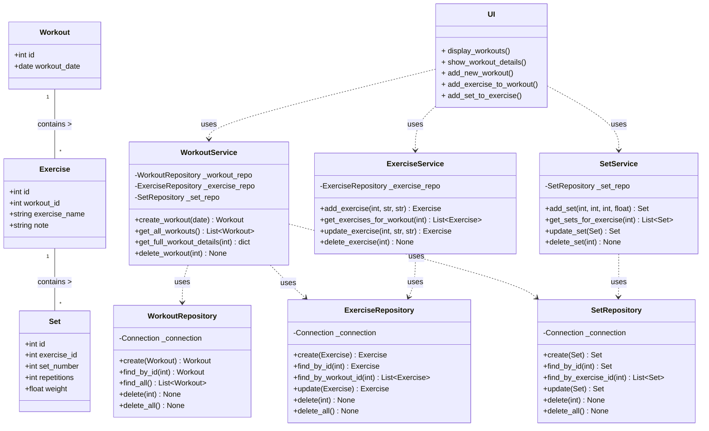

# Arkkitehtuurikuvaus

## Ohjelman Rakenne

Ohjelman rakenne noudattelee kolmitasoista kerrosarkkitehtuuria, ja koodin pakkausrakenne on seuraava:

```mermaid
classDiagram
    class Workout {
        +int id
        +date workout_date
    }
    class Exercise {
        +int id
        +int workout_id
        +string exercise_name
        +string note
    }
    class Set {
        +int id
        +int exercise_id
        +int set_number
        +int repetitions
        +float weight
    }

    class WorkoutRepository {
        -Connection _connection
        +create(Workout) Workout
        +find_by_id(int) Workout
        +find_all() List~Workout~
        +delete(int) None
        +delete_all() None
    }
    class ExerciseRepository {
        -Connection _connection
        +create(Exercise) Exercise
        +find_by_id(int) Exercise
        +find_by_workout_id(int) List~Exercise~
        +update(Exercise) Exercise
        +delete(int) None
        +delete_all() None
    }
    class SetRepository {
        -Connection _connection
        +create(Set) Set
        +find_by_id(int) Set
        +find_by_exercise_id(int) List~Set~
        +update(Set) Set
        +delete(int) None
        +delete_all() None
    }

    class WorkoutService {
        -WorkoutRepository _workout_repo
        -ExerciseRepository _exercise_repo
        -SetRepository _set_repo
        +create_workout(date) Workout
        +get_all_workouts() List~Workout~
        +get_full_workout_details(int) dict
        +delete_workout(int) None
    }
    class ExerciseService {
        -ExerciseRepository _exercise_repo
        +add_exercise(int, str, str) Exercise
        +get_exercises_for_workout(int) List~Exercise~
        +update_exercise(int, str, str) Exercise
        +delete_exercise(int) None
    }
    class SetService {
        -SetRepository _set_repo
        +add_set(int, int, int, float) Set
        +get_sets_for_exercise(int) List~Set~
        +update_set(Set) Set
        +delete_set(int) None
    }

    class UI {
        + display_workouts()
        + show_workout_details()
        + add_new_workout()
        + add_exercise_to_workout()
        + add_set_to_exercise()
    }

    Workout "1" -- "*" Exercise : contains >
    Exercise "1" -- "*" Set : contains >

    WorkoutService ..> WorkoutRepository : uses
    WorkoutService ..> ExerciseRepository : uses
    WorkoutService ..> SetRepository : uses
    ExerciseService ..> ExerciseRepository : uses
    SetService ..> SetRepository : uses

    UI ..> WorkoutService : uses
    UI ..> ExerciseService : uses
    UI ..> SetService : uses
```

Jokainen näistä on toteutettu omana luokkana 